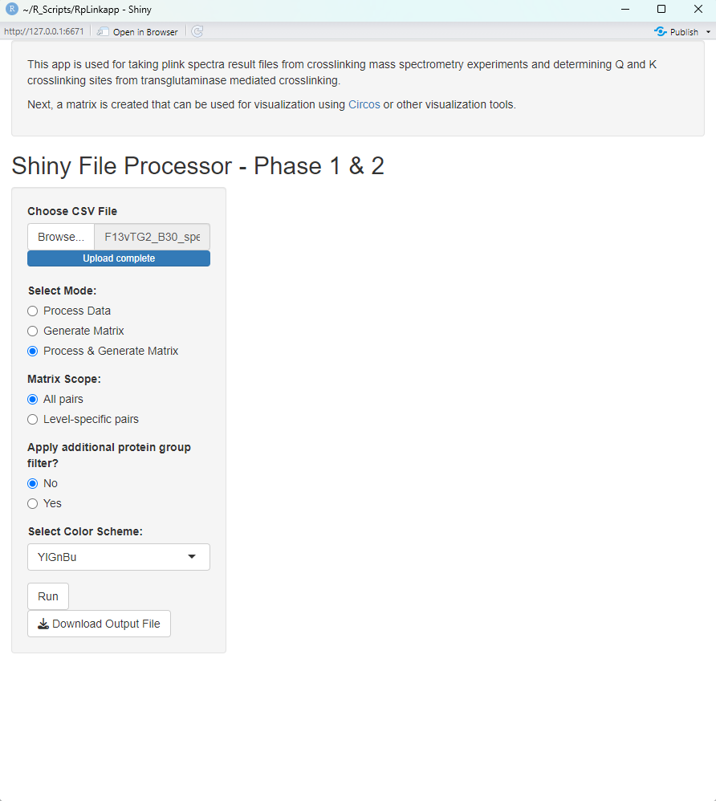
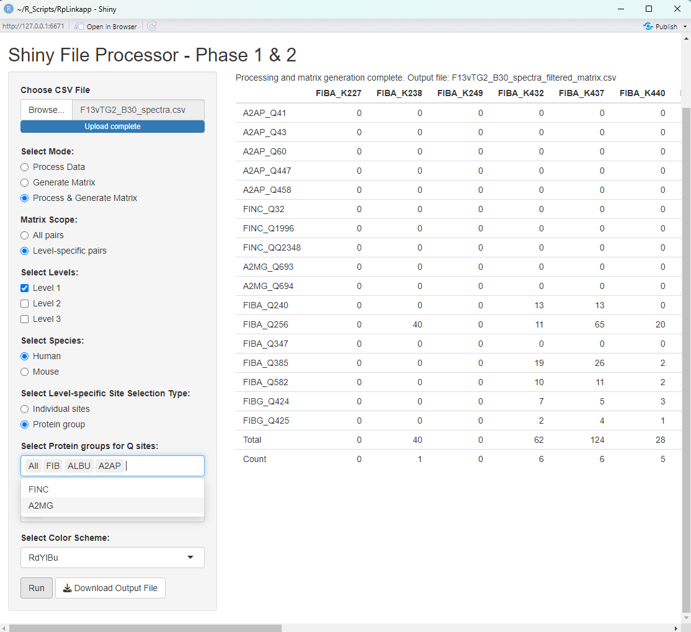
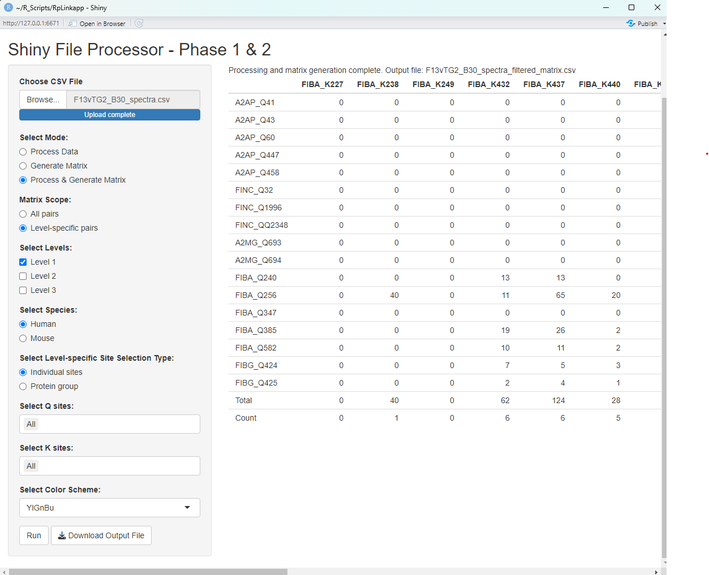
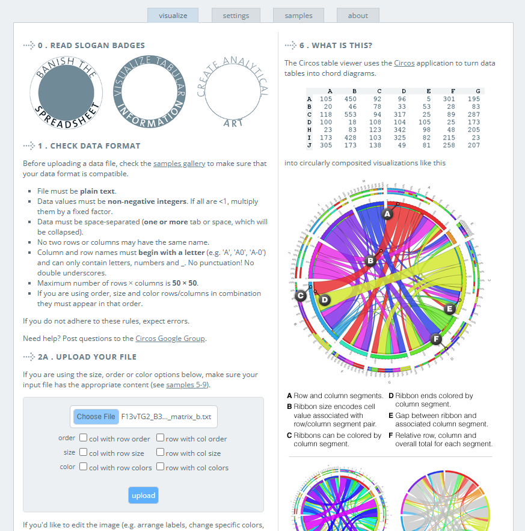
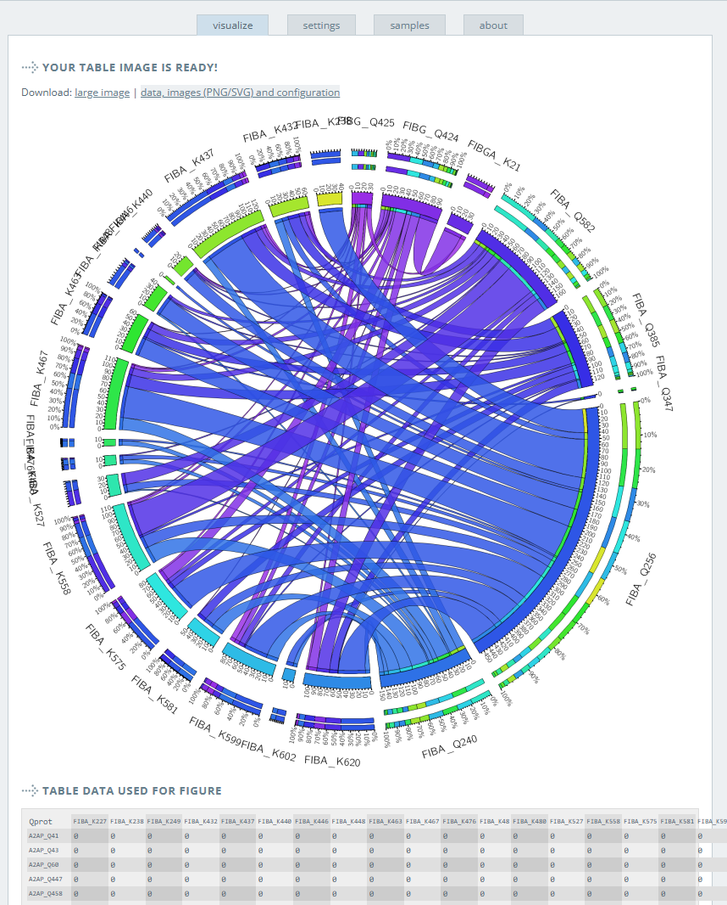

# XL-Chord

**XL-Chord** is an R Shiny app designed to process cross-linking mass spectrometry (XL-MS) search results from [pLink 3.0](https://github.com/pFindStudio/pLink3) and generate a matrix of glutamine–lysine (Q–K) cross-links suitable for visualization as a chord diagram using the [Circos](https://circos.ca/intro/tabular_visualization/) tabular interface. This tool was developed for mapping transglutaminase-mediated cross-links (e.g., FXIIIa, TG2) and is introduced in our upcoming manuscript on trauma patient plasma cross-linking.

---

## 📑 Table of Contents

- [Features](#-features)
- [Repository Contents](#-repository-contents)
- [How to Run the App](#️-how-to-run-the-app)
- [Input Instructions](#-input-instructions)
- [Output](#-output)
- [Creating a Chord Diagram with Circos](#-creating-a-chord-diagram-with-circos)
- [Editing SVG Output](#-editing-svg-output)
- [Citation](#-citation)
- [Contact](#-contact)
- [License](#-license)

---

## ⚙️ Features

- Accepts `.txt` versions of `_spectra.csv` output files from pLink 3.0 (cross-linked peptides by spectra)
- Filters and tabulates Q–K cross-links
- Generates a matrix of crosslink sites with Q sites in rows and K sites in columns
- Outputs files compatible with Circos R tools or web visualization
- The Circos tool or webserver can be used to produces high-resolution SVG images for further figure customization

---

## 🗂 Repository Contents

- `XL_Chord_ShinyApp.R`: Main R Shiny script
- `www/`: UI assets
- `test_data/`: Includes example pLink 3.0 results and output files  
    - `example_pLink_output.txt` – Sample input file  
    - `example_matrix_output.tsv` – Output matrix used by Circos  
- `screenshots/`: Demonstrations of UI and Circos setup  
    - `app_interface.png` – Full Shiny UI  
    - `input_selection.png` – File upload and filtering options  
    - `output_matrix.png` – Example matrix display  
- `circos_setup/`: Circos configuration images  
    - `circos_input_table.png` – Data import interface  
    - `circos_preview.png` – Example output  
- `output_download/`: Sample SVG results from Circos  
    - `circos_output.svg` – Ready-to-edit file

---

## ▶️ How to Run the App

### Requirements

- R version ≥ 4.2  
- Required R packages: `shiny`, `readr`, `tidyverse`

### Local Use

Clone the repository and run the app from RStudio or your terminal:

```r
shiny::runApp("path/to/XL_Chord_ShinyApp.R")
```

The app will open in your web browser. You will see an interface like the one below:



For my local machine here is the command as an example:

!shiny::runApp("C:/Users/User/Documents/R_Scripts/RpLinkapp/Rplinkappc.R")

---

## 📥 Input Instructions

- Use the browse button to upload your **pLink 3.0 cross-link results file** (`.csv`)
- Select Mode (Process & Generate Matrix in most cases)
-	separating these two can be used for troubleshooting
-Select Matrix scope as all pairs (all crosslinks in input file) or Level-specific (these are confident sites listed in the app)
- Additional protein group filtering can be introduced if yes is selected



- Select Run button and results should be shown to the right
- select download output file 


Example file:  
`test_data/F13vTG2_B30_spectra.csv`

---

## 💾 Output

The main output is a matrix file compatible with Circos:

- `output_matrix.tsv`: Matrix of cross-linked site frequencies
- Preview within app:  
  

This matrix can be downloaded and used for Circos chord diagram creation.

Expected output from example file above:
`output_download/F13vTG2_B30_spectra_filtered_matrix.csv`

---

## 🎨 Creating a Chord Diagram with Circos

Use the Circos tabular visualization webserver:  
[https://mk.bcgsc.ca/tableviewer/](https://mk.bcgsc.ca/tableviewer/)

### Quick Start Instructions

1. Visit the [Circos tableviewer](https://mk.bcgsc.ca/tableviewer/)
2. delete the "total" and "count" columns and rows in the output .csv file and save as a .txt file
3. Upload your output matrix (`output_matrix.txt`)

Example setup image:  


4. Optional: Adjust parameters under settings tab
    - **Labels**
    - **Data Filters**
    - **Value Remapping**
    - **etc..**	

5. Optional: adjust color palette, layout, and order..
details can be found here [Circos samples](https://mk.bcgsc.ca/tableviewer/samples/)

6. select upload

Resulting diagram preview for test input file:  


---

## ✏️ Editing SVG Output

Final SVG figures from Circos will appear in the app’s download directory (or download them directly from the Circos website):

- `circos_output.svg`

These can be opened in:
- **Adobe Illustrator**
- **Inkscape**

### Suggested edits:
- Remove outer arcs showing occupancy (these are redundant here) 
- Reposition labels to prevent overlap
- Modify chord coloring
- Reorder segments for clarity

---

## 📚 Citation

Please cite the tool and associated manuscript when published.  
If you are using Circos, please cite us: [Krzywinski, M. et al. Circos: an Information Aesthetic for Comparative Genomics. Genome Res (2009) 19:1639-1645](https://genome.cshlp.org/content/early/2009/06/15/gr.092759.109.abstract)

---

## 📬 Contact

For questions or issues, please open an issue in this GitHub repository or [contact us via email](mailto:kirk.hansen@cuanschutz.edu).

---

## 🔒 License

MIT License – see `LICENSE` file for details.
